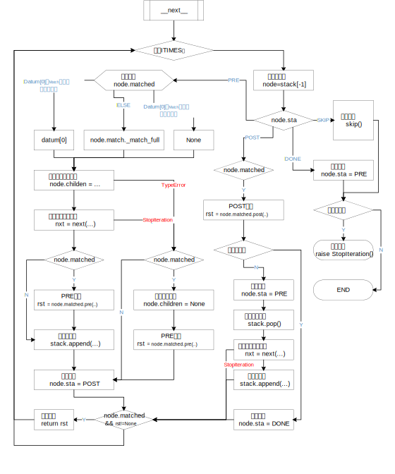

# Stack
Qmar对树的搜索采用了stack迭代方式。Qmar在内部维护了一个遍历stack。其结构如下：
```python
stack = [
    ROOT节点,
    第一层祖先节点，
    ......
    父节点,
    当前处理节点,
]
```

其中每一个节点定义如下：
```python
class NodeInfo:
    """迭代栈节点信息。"""
    def __init__(self):
        self.data           = []            #处理数据列表
        self.sta            = PRE           #当前处理状态: PRE|POST|DONE|SKIP
        self.matched        = None          #匹配动作实例。是一个Match类实例
        self.children       = None          #子节点当前迭代器
        self.match          = None          #
```

# Work Flow
Qmar迭代遍历的核心算法流程:

