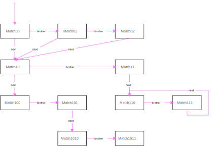

# Introduce
Qmar是一个Tree结构遍历工具。Qmar在给定的树结构中，按给定顺序执行迭代(Query)-匹配(Match)-执行(Action)-返回(Return)动作。

# Basic Concept
## Match-Action
Qmar使用comlib.mapreduce.Match类来定义数据匹配判断和对应的动作。
- match: 匹配判断函数
- pre: PRE过程动作函数
- post: POST过程动作函数
Match类定义类似如下定义。具体定义与说明见comlib.mapreduce.Match
```python
    class Match:
        def match(self, *datum, stack=[]): return True
        def pre(self, *datum, stack=[]): return None
        def post(self, *datum, stack=[]): return None
```
Qmar使用Match.match函数对数据*datum进行匹配判断，若匹配成功则执行该Match对应的pre和post函数。

## Match树
Qmar支持把一些列Match实例通过brother和next指针组织起来，形成一个Match匹配树结构。其结构类似于：



由brother指针串起来的一条match对象序列被称为一个<font color='green'>**匹配链**</font>。Qmar使用相同的datum节点数据按照brother指定的顺序在一条匹配链上依次匹配，直到找到第一个匹配的match对象。这一过程类似于'case'语句：使用同一个数据在多个条件中依次寻找第一个满足的条件。

```scala
    case( *datum, stack=[] )
        match0.match(*datum, stack=stack): match0.pre(...) && match0.post(...)
        match1.match(*datum, stack=stack): match1.pre(...) && match1.post(...)
        ......
        matchN.match(*datum, stack=stack): matchN.pre(...) && matchN.post(...)
        [else: matchElse.pre(...) && matchElse.post(...)]
```

由next指针串起来的一条match对象序列被称为一个<font color='green'>**匹配串**</font>。Qmar成功匹配到一个match后，数据节点的子节点就需要使用匹配match.next指向的match进行匹配。这一过程被称为条件顺次匹配。


# Feature

### 支持字符Match串
Qmar支持使用字符串来表示一个Match串，这种字符串被称为字符Match串。一个字符Match串的格式为：
```python
    "objNameA[conditionA] connectA objNameB[conditionB] connectB ... objNameZ[conditionZ]"
```
其中：
- objName: 当前迭代数据datum[0]的数据类型字符串
- condition: 任何符合Python的，返回bool类型的表达式
- connect: 两个匹配之间的关系表达式
- 以上3个参数都满足Match初始化参数定义。可以参考comlib.mapreduce.Match定义

字符Match串使用方式为：
```python
    a = [1,2,[3,4,[5,6],7],8,[9,[10,11],12]]
    rst = [x for x in Qmar(a).matches('list list list[len(#)%2] int[#.0%2==1]')]
```

### 支持内联匹配
内联匹配指用户通过扩展Match和Child类，把数据、匹配、子节点迭代器都柔和到一个数据类中的方法。在Qmar中，内联匹配(Qmar检测使用派生自Match)的执行优先级是高于普通的Match、Child捆绑的。

内联匹配类的定义时，必须<font color='red'>**注意**</font>以下点：
- 必须定义__init__初始化函数。并且在__init__中调用super.__init__函数。
  - Match包含3个动作函数: pred,pre和post。需要在内联匹配类中定义的动作，必须在super.__init__的参数中设置为Match.NONE。否则无法执行派生类的行为
- Child行为由sub函数进行继承

首先从Match和Child派生一个包含数据的内联匹配子类。
```python
    class MyQMar(comlib.mapreduce.Match, comlib.mapreduce.Child): # 定义派生类
      def __init__(self, v, sub=[]):    # 定义初始化函数
          super().__init__(pred=Match.NONE, pre=Match.NONE) # **注意**：必须派生必须关闭原类定义的函数行为
          self.v = v
          self.subs = sub

      def sub(self, *datum): return self.subs # 子迭代器获取函数
      def match(self,*datum, stack=[]): return datum[0].v % 2 == 0 # 定义Match行为
      def pre(self, *datum, stack=[]): return datum[0].v + 100 # 定义pre行为

```
然后实例化该类，并由Qmar进行遍历。
```python
class TestQMar:
    def test_common_qmar(self):
        node = MyQMar(0, [MyQMar(i) for i in range(1,5)])
        r = [x for x in Qmar(node).all()]
        assert r == [100,102,104]
```
